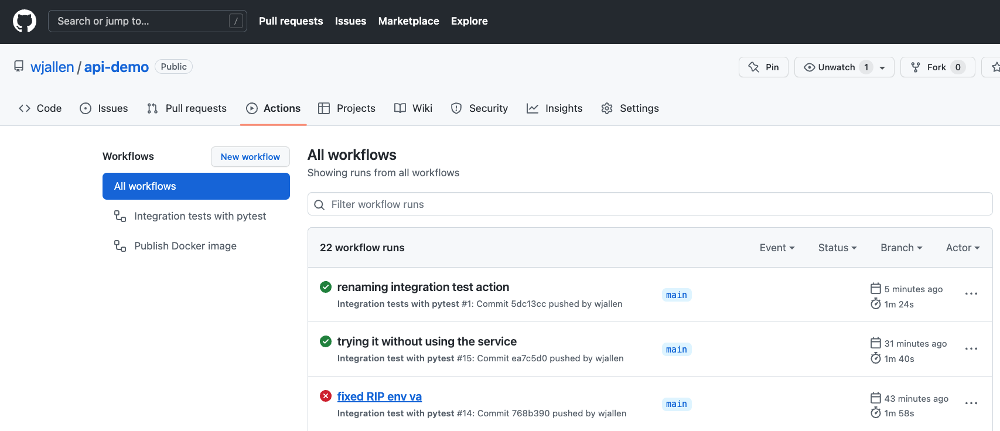
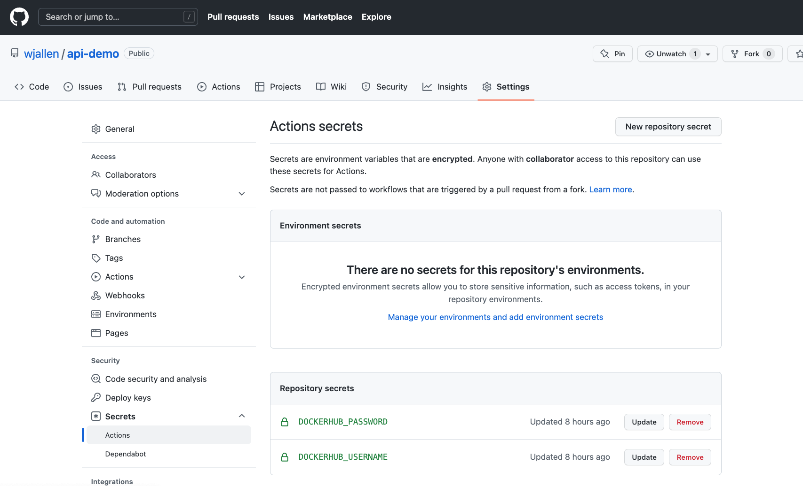
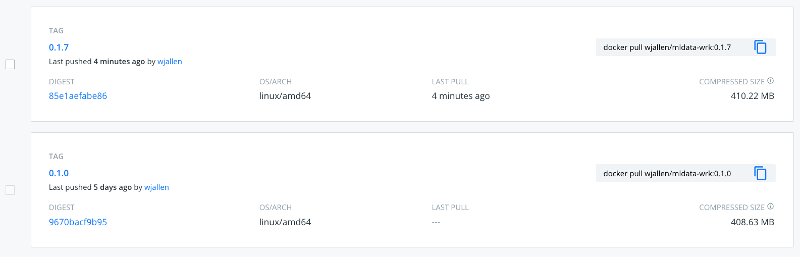

CI/CD with GitHub Actions
=========================

In a multi-developer environment, typically no one person has complete knowledge
of the entire system, and multiple changes can be happening at the same time. Even
if the changes are made in different components, it is possible for something to
break when they are integrated.
The primary goal of Continuous Integration (CI) is to enable multiple developers
to work on the same code base while ensuring the quality of the final product.
After going through this module, you should
be able to:

* Identify the importance of CI to a large software system
* Choose a CI service that meets the needs of their software system
* Perform a integration testing CI workflow with GitHub Actions
* Perform a docker build / docker push CI workflow with GitHub Actions

An Example CI Workflow
----------------------

An "integration server" (or "build server") is a dedicated server (or VM) that
prepares software for release. The server automates common tasks, including:

* Building software binaries from source code (for compiled languages)
* Running tests
* Creating images, installers, or other artifacts
* Deploying/installing the software

We are ultimately aiming for the following "Continuous Integration" work flow or
process; this mirrors the process used by a number of teams working on "large"
software systems, both in academia and industry:

* Developers (i.e., you) check out code onto a machine where they will do their
  work. This could be a VM somewhere or their local laptop.
* They make changes to the code to add a feature or fix a bug.
* Once their work is done they add any additional tests as needed and then run
  all unit tests "locally" (i.e., on the same machine).
* Assuming the tests pass, the developer commits their changes and pushes to the
  origin (in this case, GitHub).
* A pre-established build server gets a message from the origin that a new commit
  was pushed.
* The build server:

  * Checks out the latest version
  * Executes any build steps to create the software
  * Runs unit tests
  * Starts an instance of the system
  * Runs integration tests
  * Deploys the software to a staging environment

If any one of the steps above fails, the process stops. In such a situation, the
code defect should be addressed as soon as possible.

Popular Automated CI Services
------------------------------

**Jenkins** is one of the most popular free open-source CI services. It is
server-based, and it requires a web server to operate on.

* Local application
* Completely free
* Deep workflow customization
* Intuitive web interface management
* Can be distributed across multiple machines / VMs
* Rich in features and plugins
* Easy installation thanks to the pre-installed OS X, Unix and Windows packages
* A well-established product with an excellent reputation

**TravisCI** is another CI service with limited features in the free tier, and a
comprehensive paid tier. It is a cloud-hosted service, so there is no need for
you to host your own server.

* Quick setup
* Live build views
* Pull request support
* Multiple languages and platforms support
* Pre-installed database services
* Auto deployments on passing builds
* Parallel testing (paid tier)
* Scaling capacity on demand (paid tier)
* Clean VMs for every build
* Mac, Linux, and iOS support
* Connect with Github, Bitbucket and more

**GitHub Actions** is a relatively new CI service used to automate, customize,
and execute software development workflows right in your GitHub repository.

* One interface for both your source code repositories and your CI/CD pipelines
* Catalog of available Actions you can utilize without reinventing the wheel
* Hosted services are subject to usage limits, although the free-tier limits are
  `fairly generous <https://docs.github.com/en/actions/learn-github-actions/usage-limits-billing-and-administration>`_
  (for now)
* Simple YAML descriptions of workflows, many templates and examples available
* It is a newer platform, so not as many features as some of the others, but it
  is quickly gaining steam

What Will We Do With CI?
------------------------

Two obvious and useful forms of CI we can incorporate into the development of our
final projects with GitHub Actions include:

1. Automatically run unit tests (with pytest) each time new code is pushed to
   GitHub
2. Automatically build a Docker image and push it to Docker Hub each time our
   code is tagged with a new release

Example Code
------------

Before we begin, we need some example code to work with. Rather than write it from
scratch, we can borrow some existing code that is already set up for unit testing
and for containerization. Navigate to this repo on GitHub and click the 'Fork' link
near the top right: https://github.com/wjallen/pi-estimator

Once you have forked your own copy of the repo, clone it to Frontera. Make sure you
clone the SSH URL from your fork of the repository, and make sure you are
not cloning it while inside another repository:

.. attention::

   Replace 'USERNAME' below with your GitHub username.

.. code-block:: console

   [fta]$ cd ~/git-workshop/
   [fta]$ git clone git@github.com:USERNAME/pi-estimator.git
   [fta]$ cd pi-estimator
   Dockerfile      README.md       pi.py           test_pi.py

This repository contains four files:

1. **pi.py:** Contains simple Python script for estimating the value of pi
2. **test_pi.py:** Unit test formatted for ``pytest``
3. **Dockerfile:** Recipe for containerization
4. **README.md:** Commands for building and testing a container

EXERCISE
~~~~~~~~

Spend a few moments exploring the code, running the main script, and running the 
unit tests interactively. Unless you first start an interactive session with 
``idev``, please don't run anything that will take longer than ~1 second on the
login node.

Unit Testing with GitHub Actions
---------------------------------------

To set up GitHub Actions in an existing repository, create a new **hidden**
folder as follows:

.. code-block:: console

   [fta]$ pwd
   /home1/01234/username/git-workshop/pi-estimator
   [fta]$ mkdir -p .github/workflows/

Within that folder we will put YAML files describing when, how, and what workflows
should be triggered. For instance, create a new YAML file (``.github/workflows/unit-test.yml``)
to perform our unit testing with the following contents:

.. code-block:: yaml
   :linenos:

   name: Unit tests with pytest
   on: [push]
   
   jobs:
     unit-tests-with-pytest:
       runs-on: ubuntu-latest
   
       steps:
       - name: Check out repo
         uses: actions/checkout@v4
   
       - name: Set up Python
         uses: actions/setup-python@v5
         with:
           python-version: '3.9'
       
       - name: Install dependencies
         run: |
           python -m pip install --upgrade pip
           pip install pytest
       
       - name: Test with pytest
         run: |
           pytest test_pi.py

The workflow above runs our unit tests, and it is triggered on every push
(``on: [push]``). This particular workflow will run in an ``ubuntu-latest`` VM,
and it has four total ``steps``.

Some steps contain a ``uses`` keyword, which utilizes a pre-canned action from the
catalog of GitHub Actions. For example, the pre-canned actions might be used to
clone your whole repository or install Python3. The other stops contain a ``run``
keyword which are the commands to run on the VM. In the above example, commands are
run to install Pythong libraries with pip and run pytest.

QUESTION
~~~~~~~~

In the above example, Python v3.9 and external libraries (pytest) are
installed in different steps. Why was this choice made? Can this be done
differently? Is there a better way to do it?

Trigger the Integration
~~~~~~~~~~~~~~~~~~~~~~~

To trigger this integration, simply edit some source code, commit the changes,
and push to GitHub.

.. code-block:: console

   [fta]$ git add ./
   [fta]$ git commit -m "added some new code"
   [fta]$ git push

Then navigate to the repo on GitHub and click the 'Actions' tab to watch the
progress of the Action. You can click on your saved workflows to narrow the view,
or click on a specific instance of a workflow (a "run") to see the logs.

   History of all workflow runs.

By looking through the history of recent workflow runs, you can see that each is
assigned to a specific commit and commit message. That way, you know
who to credit or blame for successful or errant runs.

Docker Hub Integration with GitHub Actions
------------------------------------------

Rather than commit to GitHub AND push to Docker Hub each time you want to
release a new version of code, you can set up an integration between the two
services that automates it. The key benefit is you only have to commit to one
place (GitHub), and you can be sure the image on Docker Hub will always be in sync.

Consider the following workflow, located in ``.github/workflows/push-to-registry.yml``:

.. code-block:: yaml
   :linenos:

   name: Publish Docker image
   
   on:
     push:
       tags:
         - '*'
   
   jobs:
     push-to-registry:
       name: Push Docker image to Docker Hub
       runs-on: ubuntu-latest
   
       steps:
        - name: Check out the repo
          uses: actions/checkout@v4
   
        - name: Log in to Docker Hub
          uses: docker/login-action@v3
          with:
            username: ${{ secrets.DOCKERHUB_USERNAME }}
            password: ${{ secrets.DOCKERHUB_PASSWORD }} 
   
        - name: Set up Docker Buildx
          uses: docker/setup-buildx-action@v3
   
        - name: Extract metadata (tags, labels) for Docker
          id: meta
          uses: docker/metadata-action@v5
          with:
            images: wjallen/pi-estimator
   
        - name: Build and push Docker image
          uses: docker/build-push-action@v5
          with:
            context: .
            push: true
            file: ./Dockerfile
            tags: ${{ steps.meta.outputs.tags }}
            labels: ${{ steps.meta.outputs.labels }} 

This workflow waits is triggered when a new tag is pushed (``tag: - '*'``). As
in the previous action, this one checks out the code and stages the sample data.
Then, it uses the ``docker/login-action`` to log in to Docker Hub on the command
line. The username and password can be set by navigating to Settings => Secrets
and variables => Actions => New Repository Secret within the project repository.

   Secrets are tied to specific repos.

Finally, this workflow extracts the tag from the environment and builds / pushes
the API container, then builds / pushes the worker container both using actions
from the GitHub Actions catalogue.

.. tip::

   Don't re-invent the wheel when performing GitHub Actions. There is likely an
   existing action that already does what you're trying to do. Navigate to your
   repository, click the 'Actions' tab, then click 'New workflow' to browse.

Trigger the Integration
~~~~~~~~~~~~~~~~~~~~~~~

To trigger the build in a real-world scenario, make some changes to your source
code, push your modified code to GitHub and tag the release as ``X.Y.Z`` (whatever
new tag is appropriate) to trigger another automated build:

.. code-block:: console

   [fta]$ git add ./
   [fta]$ git commit -m "added a new route to do something"
   [fta]$ git push
   [fta]$ git tag -a 0.3 -m "release version 0.3"
   [fta]$ git push origin 0.3

By default, the git push command does not transfer tags, so we are explicitly
telling git to push the tag we created (0.3) to the repository on GitHub (origin).

Now, check the online GitHub repo to make sure your change / tag is there, and
check the Docker Hub repo to see if your new tag has been pushed.

   New tag automatically pushed.

Side Note on Semantic Versioning
~~~~~~~~~~~~~~~~~~~~~~~~~~~~~~~~

There isa well-accepted standard for versioning your code called
'`Semantic Versioning <https://semver.org/>`_'. It follows the specification:

Given a version number **MAJOR.MINOR.PATCH**, increment the:

* **MAJOR** version when you make incompatible API changes,
* **MINOR** version when you add functionality in a backwards compatible manner, and
* **PATCH** version when you make backwards compatible bug fixes.

Test a Job on Frontera
----------------------

Now you have edited code on Frontera, pushed it to GitHub, and tagged a new version.
Without ever having left the Frontera ecosystem, a new container image has been built
and push to your userspace on Docker Hub. You can run a job on Frontera that utilizes
the new image. Assemble a ``job.slurm`` file that looks like:

.. attention::

   Replace ``USERNAME/REPONAME:TAG`` with your Docker Hub username, repository name,
   and tag from the previous exercise. You can also try: ``wjallen/pi-estimator:0.4``.

.. code-block:: bash
   :linenos:

   #!/bin/bash
   #SBATCH -J myjob           # Job name
   #SBATCH -o myjob.o%j       # Name of stdout output file
   #SBATCH -e myjob.e%j       # Name of stderr error file
   #SBATCH -p development     # Queue (partition) name
   #SBATCH -N 1               # Total # of nodes (must be 1 for serial)
   #SBATCH -n 1               # Total # of mpi tasks (should be 1 for serial)
   #SBATCH -t 00:10:00        # Run time (hh:mm:ss)
   #SBATCH -A myproject       # Project/Allocation name (req'd if you have more than 1)
   
   module load tacc-apptainer
   apptainer run docker://USERNAME/REPONAME:TAG pi.py 1000000

Then submit the job but doing:

.. code-block:: console

   [fta]$ sbatch --reservation=Github_training job.slurm

Once the job completes, check the output files to see if your containerized code
has in fact been run on Frontera.

Additional Resources
--------------------

* `GitHub Actions Docs <https://docs.github.com/en/actions>`_
* `GitHub Actions Examples <https://docs.github.com/en/actions/examples>`_
* `Demo Repository <https://github.com/wjallen/pi-estimator>`_
* `Semantic Versioning <https://semver.org/>`_
